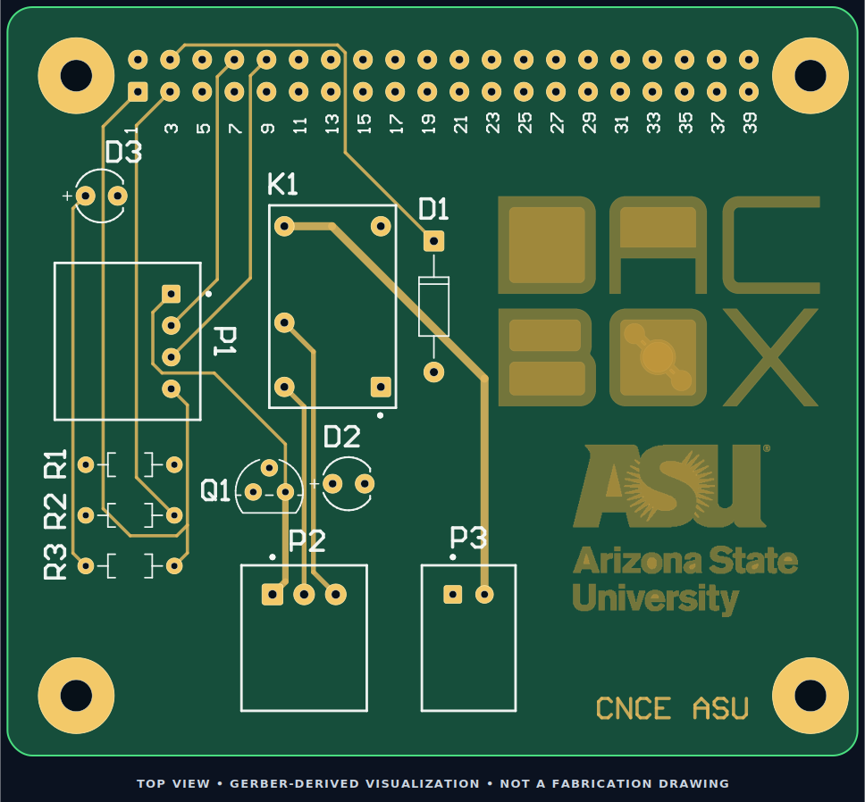
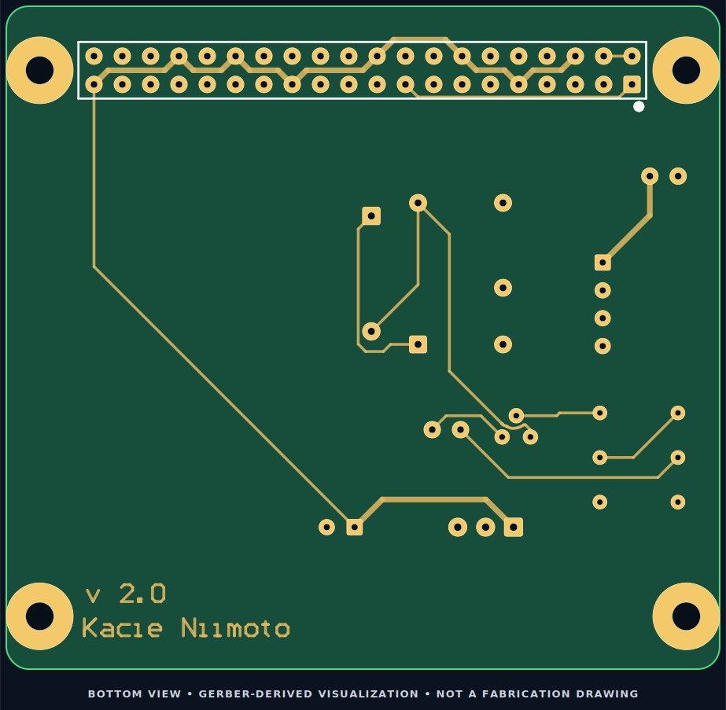
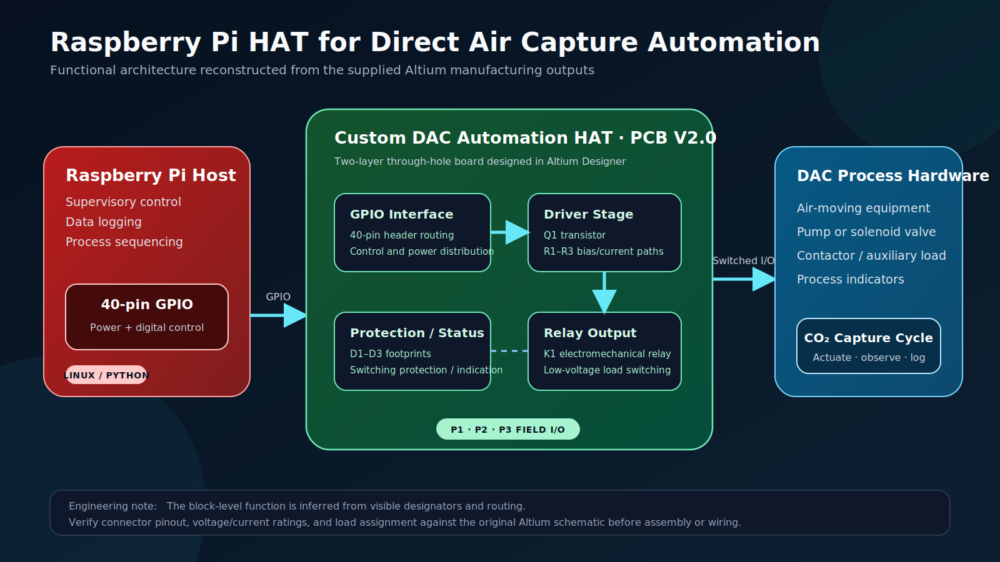
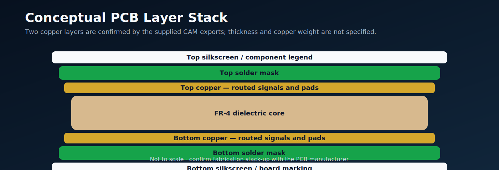

<div align="center">



# Raspberry Pi GPIO Control Board for Direct Air Capture Automation

**A custom two-layer, through-hole control board designed to connect a Raspberry Pi with relay-driven laboratory hardware used in Direct Air Capture (DAC) experiments.**

[](#engineering-summary)
[](#pcb-specification)
[](#functional-architecture)
[](#project-status)

</div>

> [!IMPORTANT]
> **DAC means Direct Air Capture in this repository, not digital-to-analog conversion.** The functional description below is based on the supplied Gerber, drill, silkscreen, and CAM-report files. The original schematic, bill of materials, and Altium source project were not included, so connector pin assignments and electrical ratings must be verified before assembly or use.

## Project overview

This project documents a Raspberry Pi HAT-style GPIO board developed for **automation hardware in a laboratory Direct Air Capture system**. The board provides a 40-pin Raspberry Pi interface, a discrete transistor/relay switching stage, indicator or protection footprints, and three field connectors for external equipment.

The supplied CAM package was generated from an Altium project identified as **`RPI GPIO BOARD - V2.0`**. The layout includes:

- A Raspberry Pi 40-pin GPIO connector
- Four mechanical mounting holes
- Relay footprint `K1`
- Transistor driver footprint `Q1`
- Resistor footprints `R1`–`R3`
- Diode or indicator footprints `D1`–`D3`
- External connectors `P1`, `P2`, and `P3`
- Top and bottom copper routing
- Top and bottom silkscreen artwork
- Arizona State University / CNCEL board markings

The repository is intended to turn the raw manufacturing exports into a clear, reviewable engineering portfolio project.

## Visual gallery

<table>
<tr>
<td width="50%" align="center"><br><b>Top copper and silkscreen</b></td>
<td width="50%" align="center"><br><b>Bottom copper and silkscreen</b></td>
</tr>
</table>

> The PCB images are reconstructed directly from the supplied Gerber geometry. They are presentation visuals—not authoritative fabrication drawings.

## Functional architecture



The visible routing and component designators suggest the following control flow:

1. The Raspberry Pi provides power and a digital control signal through the 40-pin GPIO header.
2. `Q1` and `R1`–`R3` form a discrete driver network for the switching stage.
3. `K1` provides electromechanical switching for an external process load.
4. `D1`–`D3` support switching protection, polarity control, or status indication, depending on the final schematic.
5. `P1`–`P3` provide field connections to power and external DAC hardware.

Typical DAC equipment could include a fan, pump, solenoid valve, contactor, or indicator. These are application examples only; the exact load assignment is not recoverable from the manufacturing files alone.

## Engineering summary

| Attribute | Source-derived detail |
|---|---|
| EDA tool | Altium Designer 24.10.1 |
| Project identifier | `RPI GPIO BOARD - V2.0` |
| CAM export date | January 30, 2025 |
| Board construction | Two copper layers, plated through-hole design |
| Host interface | Raspberry Pi 40-pin GPIO header |
| Primary switching device | Relay footprint `K1` |
| Driver components | `Q1`, `R1`–`R3`, `D1`–`D3` |
| Field connections | `P1`, `P2`, `P3` |
| Total plated holes | 73 |
| Minimum routing width | 10 mil / 0.254 mm |
| Minimum clearance | 10 mil / 0.254 mm |
| Solder-mask expansion rule | 4 mil / 0.102 mm |
| Approximate plotted envelope | 61.2 mm × 53.5 mm — not an authoritative board dimension |

## PCB specification



### NC drill summary

| Tool | Finished drill diameter | Count | Plating |
|---:|---:|---:|---|
| T1 | 0.749 mm / 30 mil | 6 | PTH |
| T2 | 0.813 mm / 32 mil | 3 | PTH |
| T3 | 0.899 mm / 35 mil | 46 | PTH |
| T4 | 1.001 mm / 39 mil | 9 | PTH |
| T5 | 1.059 mm / 42 mil | 2 | PTH |
| T6 | 1.151 mm / 45 mil | 3 | PTH |
| T7 | 2.751 mm / 108 mil | 4 | PTH |
| **Total** |  | **73** |  |

The four 2.751 mm holes correspond visually to the board mounting locations. Confirm finished-hole tolerances and mechanical fit before ordering.

## Repository structure

```text
.
├── README.md
├── .gitignore
├── assets/
│   ├── pcb-top-view.svg
│   ├── pcb-bottom-view.svg
│   ├── system-architecture.svg
│   └── pcb-layer-stack.svg
├── docs/
│   ├── MANUFACTURING_NOTES.md
│   ├── RELEASE_CHECKLIST.md
│   └── SOURCE_AND_ASSUMPTIONS.md
├── hardware/
│   └── README.md
└── manufacturing/
    ├── README.md
    └── gerbers/
        └── supplied CAM, drill, layer, and report files
```

## Viewing the manufacturing files

The Gerber files can be inspected with any standards-compliant Gerber viewer. Load the top copper, bottom copper, legend, mechanical, and drill files together and confirm that:

- Layer alignment is correct
- The board outline is closed and unambiguous
- Drill hits align with pads
- Silkscreen does not overlap exposed copper
- Connector pin 1 markings are clear
- Mounting-hole positions match the intended Raspberry Pi hardware

The generated images in `assets/` are optimized for documentation. Use the original CAM files—not the SVG images—for fabrication review.

## Project status

### Available

- Top and bottom copper Gerber outputs
- Top and bottom legend outputs
- Selected mechanical and assembly outputs
- NC drill file and drill report
- Altium aperture, layer-pair, extension, CAM, and rule reports
- Gerber-derived visual documentation

### Required before fabrication or electrical testing

- Original `.PcbDoc` and `.SchDoc` source files
- Schematic PDF with connector pinout
- Bill of materials with manufacturer part numbers
- Complete board-profile / outline export
- Complete solder-mask outputs
- Pick-and-place file if automated assembly is planned
- Board thickness, copper weight, finish, and material specification
- Relay contact voltage/current rating
- GPIO operating-voltage verification
- External load and power-supply requirements
- Clean DRC and electrical-rule-check evidence
- Bench-test results and assembled-board photographs

> [!CAUTION]
> Do not connect mains voltage, high-current loads, pumps, valves, heaters, or other equipment until the schematic, relay rating, trace current capacity, connector rating, grounding, and protection strategy have been independently verified.

## Reproducing the CAM package in Altium Designer

1. Open the original schematic and PCB documents.
2. Update the PCB from the validated schematic.
3. Run design-rule checks and resolve all violations.
4. Verify the mechanical board outline and Raspberry Pi header alignment.
5. Generate Gerber or Gerber X2 outputs for copper, solder mask, silkscreen, and profile layers.
6. Generate the plated and non-plated NC drill outputs.
7. Export the BOM, pick-and-place file, schematic PDF, and assembly drawings.
8. Review the complete package in an independent Gerber viewer.
9. Archive the verified outputs as a tagged GitHub release.

## Verification plan

A strong engineering release should document the following tests:

| Test | Method | Acceptance criterion |
|---|---|---|
| GPIO idle-state safety | Power-on observation with relay disconnected | Relay remains in the intended default state |
| Driver switching | Oscilloscope or multimeter at `Q1` / relay coil | Clean transition without GPIO overstress |
| Relay actuation | Controlled low-voltage bench supply | Repeatable switching without excessive heating |
| Contact continuity | Four-wire or low-resistance measurement | Closed/open states match the relay specification |
| Flyback suppression | Oscilloscope during relay turn-off | Transient remains within component ratings |
| Connector mapping | Continuity test against schematic | Every pin matches the documented net |
| Thermal behavior | Rated-load endurance test | No component, trace, or connector exceeds its limit |
| Raspberry Pi integration | Automated cycle script | Stable operation across repeated DAC cycles |

## Contribution statement

Before presenting this project in a job application, add a precise description of your personal work. For example:

```text
My contribution: designed the relay-driver schematic, selected footprints,
routed the two-layer PCB in Altium Designer, configured DRC constraints,
generated manufacturing outputs, reviewed the Gerbers, assembled the board,
and validated switching through a Raspberry Pi control script.
```

Keep only the work you personally completed. The supplied files alone do not establish authorship for every design stage. The bottom silkscreen also contains a contributor name; preserve accurate attribution and document team roles clearly.

## Suggested GitHub metadata

**Repository name**

```text
dac-automation-raspberry-pi-hat
```

**Description**

```text
Two-layer Raspberry Pi GPIO control board for relay-driven automation of laboratory Direct Air Capture hardware, designed in Altium Designer.
```

**Topics**

```text
raspberry-pi  pcb-design  altium-designer  direct-air-capture
embedded-systems  hardware-automation  relay-control  gerber
```

---

<div align="center">
<b>Direct Air Capture · Embedded Control · PCB Design · Raspberry Pi · Hardware Automation</b>
</div>
